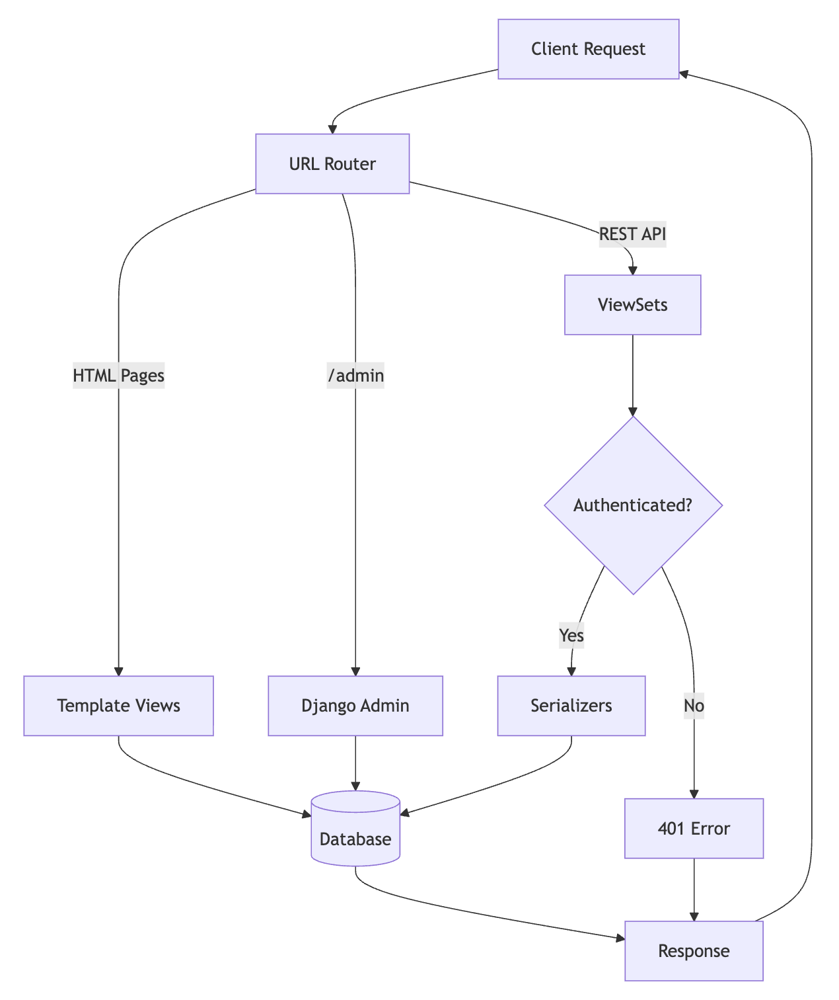

# Django Backend - Step-by-Step Guide

A comprehensive tutorial for building a Django REST API with a books and authors database. This guide walks you through every step from setup to deployment.

## Table of Contents
- [Prerequisites](#prerequisites)
- [Project Setup](#project-setup)
- [System Flow](#system-flow)
- [Step 1: Install Dependencies](#step-1-install-dependencies)
- [Step 2: Create Django Project and the Books App](#step-2-create-django-project)
- [Step 3: Configure Settings](#step-3-configure-settings)
- [Step 4: Define Models](#step-4-define-models)
- [Step 5: Create Serializers](#step-5-create-serializers)
- [Step 6: Build ViewSets](#step-6-build-viewsets)
- [Step 7: Configure URLs](#step-7-configure-urls)
- [Step 8: Frontend Options](#step-8-frontend-options)
- [Step 9: Create Sample Data with Fixtures](#step-9-create-sample-data-with-fixtures)
- [Step 10: Run Migrations and Load Data](#step-10-run-migrations-and-load-data)
- [Step 11: Add Token Authentication](#step-11-add-token-authentication)
- [Step 12: Test the API](#step-12-test-the-api)
- [Resources](#resources)

---

## Prerequisites

Before you begin, ensure you have:
- Python 3.10+ installed
- pip (Python package manager)
- Basic understanding of Python and REST APIs
- A terminal/command line interface
- Basic understanding of Docker 

---

## Project Setup

### Directory Structure
Your project will look like this:
```
backend/
├── requirements.txt          # Python dependencies
├── core/                     # Django project folder
│   ├── manage.py            # Django CLI tool
│   ├── core/                # Project settings
│   │   ├── __init__.py
│   │   ├── settings.py      # Main configuration
│   │   ├── urls.py          # URL routing
│   │   ├── asgi.py
│   │   └── wsgi.py
│   └── books/               # Books app
│       ├── models.py        # Database models
│       ├── serializers.py   # REST Framework serializers
│       ├── viewsets.py      # API viewsets
│       ├── views.py         # HTML views
│       ├── urls.py          # URL patterns
│       ├── admin.py         # Admin panel config
│       └── templates/       # HTML templates
```
---

## System Flow

Below is a basic flowchart that demonstrates the basic flow of the system we have built:

<div align="center">



**Figure 1** - [Basic System Flow](resources/system-flow.md)

</div>

---

## Step 1: Install Dependencies

### Create virtual environment

**On Mac/Linux:**
```bash
# Create virtual environment
python3 -m venv venv

# Activate virtual environment
source venv/bin/activate
```

**On Windows:**
```bash
# Create virtual environment
python -m venv venv

# Activate virtual environment
venv\Scripts\activate
```

Once activated, you should see `(venv)` at the beginning of your command prompt.

### Create requirements.txt

See the detailed [requirements.txt](requirements.txt) file for dependency explanations. The core packages you need are:

```bash
# Install all dependencies
pip install -r requirements.txt
```

Or install individually:

```bash
pip install Django
pip install djangorestframework
pip install drf-yasg
pip install django-cors-headers
pip install django-filter
```

**Key Packages:**
- **Django**: Web framework
- **Django REST Framework (DRF)**: Build REST APIs
- **drf-yasg**: Auto-generate API documentation
- **django-cors-headers**: Enable CORS for frontend
- **django-filter**: Add filtering to API endpoints

---

## Step 2: Create Django Project and Book App

Initialize your Django project and app:

```bash
# Create Django project (if not already created)
django-admin startproject core

# Navigate to the core directory
cd core

# Create the books app
python manage.py startapp books
```

---

## Step 3: Configure Settings

Edit `core/settings.py` to add installed apps and middleware:

### Add Apps to INSTALLED_APPS

```python
INSTALLED_APPS = [
    'django.contrib.admin',
    'django.contrib.auth',
    'django.contrib.contenttypes',
    'django.contrib.sessions',
    'django.contrib.messages',
    'django.contrib.staticfiles',
    # Third-party apps
    "rest_framework",
    "rest_framework.authtoken",
    "django_filters",
    "drf_yasg",
    "corsheaders",
    # Your apps
    "books",
]
```

### Add CORS Middleware

Insert `corsheaders.middleware.CorsMiddleware` in MIDDLEWARE (after SecurityMiddleware preferably):

```python
MIDDLEWARE = [
    'django.middleware.security.SecurityMiddleware',
    'django.contrib.sessions.middleware.SessionMiddleware',
    'corsheaders.middleware.CorsMiddleware',  # Add this
    'django.middleware.common.CommonMiddleware',
    'django.middleware.csrf.CsrfViewMiddleware',
    'django.contrib.auth.middleware.AuthenticationMiddleware',
    'django.contrib.messages.middleware.MessageMiddleware',
    'django.middleware.clickjacking.XFrameOptionsMiddleware',
]
```

### Configure CORS (at the bottom of settings.py)

```python
# CORS settings - allows frontend to make requests
CORS_ALLOW_ALL_ORIGINS = True  # For development only!
# In production, specify allowed origins:
# CORS_ALLOWED_ORIGINS = [
#     "https://yourdomain.com",
# ]
```

Note: `CORS_ALLOW_ALL_ORIGINS = True` is only to be used for development purposes. In production, this creates a security vulnerability as any website can access your API. Always use `CORS_ALLOWED_ORIGINS` with specific domains in production.

### Configure REST Framework Pagination

```python
REST_FRAMEWORK = {
    'DEFAULT_PAGINATION_CLASS': 'rest_framework.pagination.PageNumberPagination',
    'PAGE_SIZE': 10,
}
```

---

## Step 4: Define Models

Edit `books/models.py`:

```python
from django.db import models


class Author(models.Model):
    name = models.CharField(max_length=255)
    birth_date = models.DateField(null=True, blank=True)
    country = models.CharField(max_length=100, blank=True)

    def __str__(self):
        return self.name

    class Meta:
        ordering = ['name']


class Book(models.Model):
    title = models.CharField(max_length=255)
    author = models.ForeignKey(Author, on_delete=models.CASCADE, related_name='books')
    published_date = models.DateField()
    isbn = models.CharField(max_length=13, unique=True)

    def __str__(self):
        return self.title

    class Meta:
        ordering = ['title']
```

**Key Concepts:**
- `ForeignKey`: Creates a many-to-one relationship (many books → one author)
- `related_name='books'`: Access an author's books with `author.books.all()`
- `on_delete=CASCADE`: Delete books when author is deleted
- `__str__()`: String representation for admin panel

---

## Step 5: Create Serializers

Create `books/serializers.py`:

```python
from rest_framework import serializers
from .models import Book, Author


class BookSummarySerializer(serializers.ModelSerializer):
    """
    Simple serializer for books without nested author (to avoid circular reference).
    """
    class Meta:
        model = Book
        fields = ['id', 'title', 'published_date', 'isbn']


class AuthorSerializer(serializers.ModelSerializer):
    """
    Serializer for the Author model with nested books.
    """
    books = BookSummarySerializer(many=True, read_only=True)

    class Meta:
        model = Author
        fields = ['id', 'name', 'birth_date', 'country', 'books']


class BookSerializer(serializers.ModelSerializer):
    """
    Serializer for the Book model with nested author data.
    Shows full author object in responses, accepts author ID for creation/updates.
    """
    author = AuthorSerializer(read_only=True)
    author_id = serializers.PrimaryKeyRelatedField(
        queryset=Author.objects.all(),
        source='author',
        write_only=True
    )

    class Meta:
        model = Book
        fields = ['id', 'title', 'author', 'author_id', 'published_date', 'isbn']
```

**Key Concepts:**
- `BookSummarySerializer`: Prevents circular references (Author → Books → Author → ...)
- `read_only=True`: Field appears in responses but not required in requests
- `write_only=True`: Field required in requests but not shown in responses
- `PrimaryKeyRelatedField`: Accept author ID when creating/updating books

---

## Step 6: Build ViewSets

Create `books/viewsets.py`:

```python
from rest_framework import viewsets, filters
from .models import Book, Author
from .serializers import BookSerializer, AuthorSerializer


class AuthorViewSet(viewsets.ModelViewSet):
    """
    A ViewSet for viewing and editing Author instances.
    Provides: list, create, retrieve, update, partial_update, destroy
    """
    queryset = Author.objects.all()
    serializer_class = AuthorSerializer
    filter_backends = [filters.SearchFilter, filters.OrderingFilter]
    search_fields = ['name', 'country']
    ordering_fields = ['name', 'birth_date']
    ordering = ['name']


class BookViewSet(viewsets.ModelViewSet):
    """
    A ViewSet for viewing and editing Book instances.
    Provides: list, create, retrieve, update, partial_update, destroy
    """
    queryset = Book.objects.select_related('author').all()
    serializer_class = BookSerializer
    filter_backends = [filters.SearchFilter, filters.OrderingFilter]
    search_fields = ['title', 'author__name', 'isbn']
    ordering_fields = ['title', 'published_date']
    ordering = ['title']
```

**Key Concepts:**
- `ModelViewSet`: Automatically provides CRUD operations
- `select_related('author')`: Optimizes database queries (prevents N+1 problem)
- `search_fields`: Enable search with `?search=query`
- `ordering_fields`: Allow sorting with `?ordering=title`

**Auto-generated endpoints:**
- `GET /api/books/` - List all books
- `POST /api/books/` - Create a book
- `GET /api/books/{id}/` - Get a specific book
- `PUT /api/books/{id}/` - Update a book
- `PATCH /api/books/{id}/` - Partially update a book
- `DELETE /api/books/{id}/` - Delete a book

---

## Step 7: Configure URLs

### Edit books/urls.py

Create `books/urls.py`:

```python
from django.urls import path, include
from rest_framework.routers import DefaultRouter
from .viewsets import BookViewSet, AuthorViewSet
from . import views

router = DefaultRouter()
router.register(r'api/authors', AuthorViewSet)
router.register(r'api/books', BookViewSet)

urlpatterns = [
    # HTML views
    path('', views.home, name='home'),
    path('authors/', views.author_list, name='author_list'),
    path('books/', views.book_list, name='book_list'),

    # API endpoints
    path('', include(router.urls)),
]
```

### Edit core/urls.py

```python
from django.contrib import admin
from django.urls import path, include, re_path
from rest_framework import permissions
from drf_yasg.views import get_schema_view
from drf_yasg import openapi

schema_view = get_schema_view(
    openapi.Info(
        title="BookDB API",
        default_version='v1',
        description="""
        BookDB - A simple Django REST API for managing books and authors.
        Demonstrates CRUD operations with nested relationships.
        """,
    ),
    public=True,
    permission_classes=(permissions.AllowAny,),
    authentication_classes=[],
)

urlpatterns = [
    path('admin/', admin.site.urls),
    path('home/', include('books.urls')),

    # API documentation
    path('api-auth/', include('rest_framework.urls')),

    # Swagger documentation URLs
    re_path(r'^swagger(?P<format>\.json|\.yaml)$', schema_view.without_ui(cache_timeout=0), name='schema-json'),
    path('swagger/', schema_view.with_ui('swagger', cache_timeout=0), name='schema-swagger-ui'),
    path('redoc/', schema_view.with_ui('redoc', cache_timeout=0), name='schema-redoc'),
]
```

**Available URLs:**
- `/admin/` - Django admin panel
- `/home/` - Home page
- `/home/authors/` - Authors list
- `/home/books/` - Books list
- `/home/api/authors/` - Authors API
- `/home/api/books/` - Books API
- `/swagger/` - Swagger UI documentation
- `/redoc/` - ReDoc documentation

**Things of Note**
- `/admin/` is Django's provided interface that is used to make CRUD operations all withing a GUI.
-`/swagger/`, similarity to the administrator panel, allows you to make those said CRUD operations and provides a json response of the results.

---

## Step 8: Frontend Options

### Django Templates (Optional)

This project includes basic Django templates for viewing data in the browser. The templates are located in [books/templates/](core/books/templates/) and provide simple HTML views for authors and books.

**Template views available:**
- `/home/` - Home page with links
- `/home/authors/` - List of all authors
- `/home/books/` - List of all books

These templates are useful for quick testing and demonstrations, but **they are optional and not the recommended approach for production applications**.

### Recommended: Any React Frontend

For a modern, production-ready frontend, we recommend building a separate frontend application. Our preferred in our stack is **Next.js**. This then consumes this Django REST API.

**Benefits of a React Frontend:**
- *Better separation of concerns (backend/frontend)* - This proves to be very import as it regards to progressive development of the aspects of your application.


The Django backend serves purely as a REST API, while Next.js handles all UI rendering and user interactions.

---

## Step 9: Create Sample Data with Fixtures

Django fixtures are the built-in way to load initial data into your database. They use a specific JSON format that Django can directly import.

### What are Fixtures?

Fixtures are JSON (or YAML/XML) files that contain serialized database data. Django can load them with a single command, making them perfect for:
- Sample/demo data
- Test data
- Initial application data

### Create Fixtures Directory

```bash
# Navigate to books app
cd backend/core/books

# Create fixtures directory
mkdir fixtures
```

### Create the Fixture File

The fixture file has already been created at [books/fixtures/initial_data.json](core/books/fixtures/initial_data.json).

**What's included:**
- 3 Authors: J.K. Rowling, George Orwell, Harper Lee
- 5 Books: Including Harry Potter series, 1984, Animal Farm, To Kill a Mockingbird

**Example fixture format:**
```json
[
  {
    "model": "books.author",
    "pk": 1,
    "fields": {
      "name": "J.K. Rowling",
      "birth_date": "1965-07-31",
      "country": "United Kingdom"
    }
  },
  {
    "model": "books.book",
    "pk": 1,
    "fields": {
      "title": "Harry Potter and the Philosopher's Stone",
      "author": 1,
      "published_date": "1997-06-26",
      "isbn": "9780747532699"
    }
  }
]
```

**Fixture Format Explained:**
- `model`: App name + model name (`books.author` or `books.book`)
- `pk`: Primary key (the ID)
- `fields`: Dictionary of field names and values
- Order matters: Authors must come before Books (because of ForeignKey relationship)

### Loading Fixtures

```bash
# Load the fixture
python manage.py loaddata initial_data

# Output:
# Installed 8 object(s) from 1 fixture(s)
```

### Creating Your Own Fixtures

You can export your database data to create custom fixtures:

```bash
# Export all books app data
python manage.py dumpdata books --indent 2 > books/fixtures/my_data.json
```

This creates a fixture file from your current database that you can reload later or share with others.

**Pro Tips:**
- Use `--indent 2` for readable JSON
- Fixtures are automatically discovered in `<app>/fixtures/` directories
- You can load multiple fixtures: `python manage.py loaddata fixture1 fixture2`
- Use `--exclude` to skip certain models: `python manage.py dumpdata --exclude auth.permission --indent 2


---

## Step 10: Run Migrations and Load Data

Now that everything is set up, create and apply database migrations:

```bash
# Navigate to the core directory
cd backend/core

# Create migration files
python manage.py makemigrations

# Apply migrations to database
python manage.py migrate

# Create a superuser for admin access
python manage.py createsuperuser
# Follow the prompts to set username, email, and password
# Example: username=admin, email=admin@example.com, password=admin123

# Load sample data from fixtures
python manage.py loaddata initial_data
```

**What just happened?**
1. `makemigrations` - Created migration files based on your models
2. `migrate` - Applied migrations to create database tables
3. `createsuperuser` - Created an admin account for Django admin panel
4. `loaddata` - Loaded sample data from the fixture file (3 authors + 5 books)

**Verify the data was loaded:**
```bash
# Open Django shell
python manage.py shell

# Run these Python commands
from books.models import Author, Book

# Check authors
print(f"Authors: {Author.objects.count()}")
for author in Author.objects.all():
    print(f"  - {author.name} ({author.books.count()} books)")

# Check books
print(f"\nBooks: {Book.objects.count()}")
for book in Book.objects.all():
    print(f"  - {book.title} by {book.author.name}")

# Exit shell
exit()
```

---

## Step 11: Add Token Authentication

We'll implement token-based authentication using Django REST Framework's built-in token system. This is simpler than JWT but still secure for most applications.

### Update Settings

The authentication configuration has already been added to [core/settings.py](core/core/settings.py):

```python
REST_FRAMEWORK = {
    'DEFAULT_PAGINATION_CLASS': 'rest_framework.pagination.PageNumberPagination',
    'PAGE_SIZE': 10,
    'DEFAULT_AUTHENTICATION_CLASSES': [
        'rest_framework.authentication.TokenAuthentication',
        'rest_framework.authentication.SessionAuthentication',
    ],
}
```

**What this does:**
- `TokenAuthentication`: Authenticate using tokens in the Authorization header
- `SessionAuthentication`: Fallback to Django session cookies (for browsable API)
- `IsAuthenticatedOrReadOnly`: Anyone can read (GET), only authenticated users can write (POST/PUT/DELETE)

### Run Migrations

Token authentication requires a database table:

```bash
python manage.py migrate
```

This creates the `authtoken_token` table.

### Token Authentication Endpoints

The token auth endpoint has been added to [core/urls.py](core/core/urls.py):

```python
path('api/token-auth/', authtoken_views.obtain_auth_token, name='api_token_auth'),
```

### Testing in Swagger

1. **Open Swagger UI:** `http://127.0.0.1:8000/swagger/`

2. **Get your token first:**
   - Use curl or Python to get your token from `/api/token-auth/`
   - Or get it from Django shell

3. **Authorize in Swagger:**
   - Click the "Authorize" button at the top
   - In the "tokenAuth" section, enter: `Token your-token-here`
   - Click "Authorize" then "Close"

4. **Now you can test POST/PUT/DELETE operations**

### Permission Classes Explained

You can customize permissions per viewset in [books/viewsets.py](core/books/viewsets.py):

```python
from rest_framework import viewsets, permissions

class AuthorViewSet(viewsets.ModelViewSet):
    queryset = Author.objects.all()
    serializer_class = AuthorSerializer

    # Override default permissions
    # permission_classes = [permissions.AllowAny]  # No auth required
    # permission_classes = [permissions.IsAuthenticated]  # Auth for everything
```

### Token Management

**Token best practices:**
- Tokens don't expire by default (unlike JWT)
- Store tokens securely in your frontend
- Use HTTPS in production
- Regenerate tokens if compromised

---

## Step 12: Test the API

### Start the Development Server

```bash
python manage.py runserver
```

**OR**

```bash
docker compose up 
```

The server will start at `http://127.0.0.1:8000/`

### Initialize Data

```bash
python manage.py loaddata initial_data 
```

### Test Endpoints

#### 1. View the Home Page

```bash
# Open in browser
http://127.0.0.1:8000/home/
```

#### 2. Test API Endpoints with Swagger UI

Swagger UI provides an interactive interface to test your API directly in the browser.

**Access Swagger UI:**
```
http://127.0.0.1:8000/swagger/
```

**How to use Swagger UI:**

1. **View Available Endpoints**
   - When you open Swagger, you'll see all available endpoints organized by resource (books, authors)
   - Each endpoint shows the HTTP method (GET, POST, PUT, DELETE) and path

2. **List All Authors (GET)**
   - Click on `GET /home/api/authors/` to expand it
   - Click the "Try it out" button
   - Click "Execute" to see the response
   - You'll see all 3 authors from your fixture data

3. **Get a Specific Author (GET)**
   - Click on `GET /home/api/authors/{id}/`
   - Click "Try it out"
   - Enter an ID (e.g., `1` for J.K. Rowling)
   - Click "Execute"
   - View the author details with their books

4. **Create a New Author (POST)**
   - Click on `POST /home/api/authors/`
   - Click "Try it out"
   - Edit the request body JSON:
     ```json
     {
       "name": "Jane Austen",
       "birth_date": "1775-12-16",
       "country": "United Kingdom"
     }
     ```
   - Click "Execute"
   - Check the response - you should see the newly created author with an ID

5. **Update an Author (PUT)**
   - Click on `PUT /home/api/authors/{id}/`
   - Click "Try it out"
   - Enter the author ID (e.g., `4`)
   - Modify the request body:
     ```json
     {
       "name": "Jane Austen",
       "birth_date": "1775-12-16",
       "country": "England"
     }
     ```
   - Click "Execute"

6. **Delete an Author (DELETE)**
   - Click on `DELETE /home/api/authors/{id}/`
   - Click "Try it out"
   - Enter the author ID to delete
   - Click "Execute"
   - Check the response (should be 204 No Content)

7. **Create a New Book (POST)**
   - Click on `POST /home/api/books/`
   - Click "Try it out"
   - Edit the request body:
     ```json
     {
       "title": "Pride and Prejudice",
       "author_id": 4,
       "published_date": "1813-01-28",
       "isbn": "9780141439518"
     }
     ```
   - Click "Execute"

8. **Search and Filter Books**
   - Click on `GET /home/api/books/`
   - Click "Try it out"
   - Use the filter parameters:
     - `search`: Enter "Harry" to find Harry Potter books
     - `search`: Enter "Orwell" to find books by George Orwell
     - `ordering`: Enter "published_date" to sort by date
     - `ordering`: Enter "-published_date" to reverse sort
   - Click "Execute"

**Pro Tips:**
- Swagger saves your test data during the session
- You can see the actual API request URL and response
- Use the "Models" section at the bottom to see the data structure
- All endpoints are color-coded: GET (blue), POST (green), PUT (orange), DELETE (red)
- For development, its always best to utilize a dockerized form of your backend for ease of development. This becomes especially important when you incorporate a frontend with it.

---

## Resources

- [Django Documentation](https://docs.djangoproject.com/)
- [Django REST Framework](https://www.django-rest-framework.org/)
- [drf-yasg Documentation](https://drf-yasg.readthedocs.io/)
- [Django CORS Headers](https://github.com/adamchainz/django-cors-headers)

---

**Happy Coding! 🚀**
