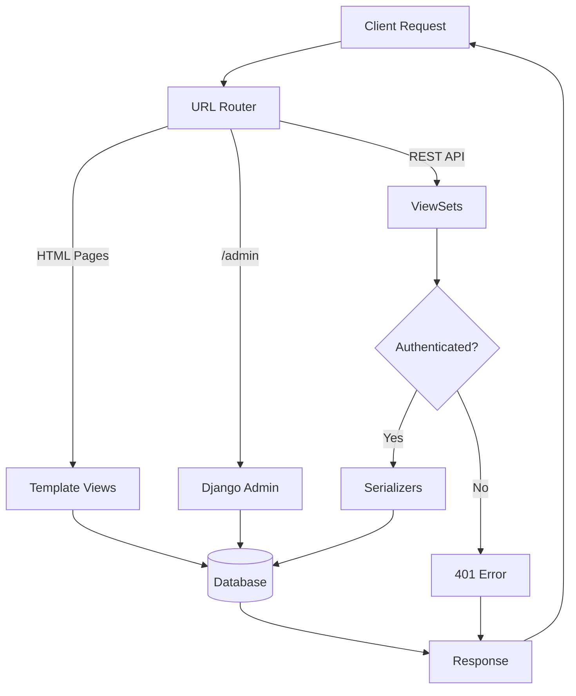

# BookDB Backend - System Flow

## Basic Flow

1. **Client** sends request
2. **Router** directs to HTML views, REST API, or Admin
3. **Authentication** checks if user can perform write operations
4. **Serializers** validate and format API data
5. **Database** stores Authors and Books
6. **Response** sent back to client
